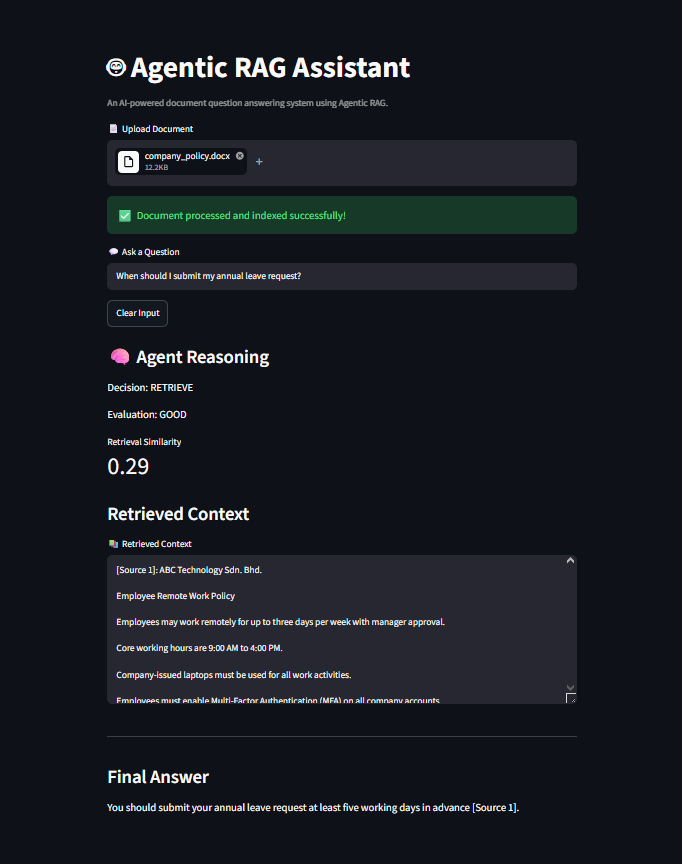
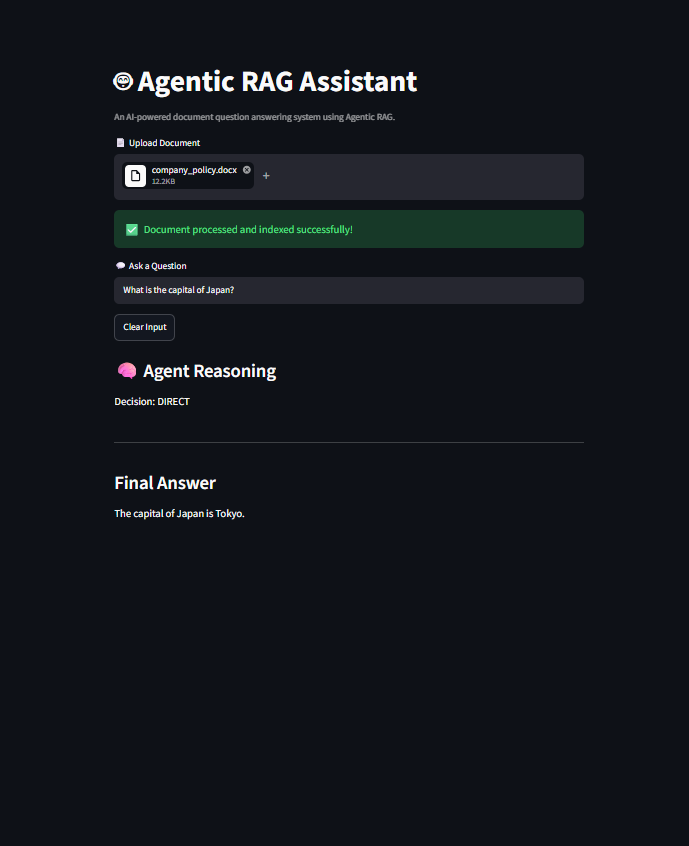
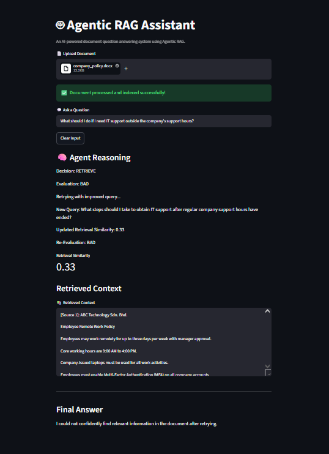

# 🤖 Agentic RAG Assistant

An AI-powered document question answering system that demonstrates an **Agentic Retrieval-Augmented Generation (RAG)** workflow.

Unlike a traditional RAG pipeline, this project introduces an agentic workflow that decides whether document retrieval is necessary, evaluates retrieved context, rewrites queries when retrieval is insufficient, and generates grounded answers using uploaded documents.

---

## ✨ Features

- 📄 Upload `.txt` and `.docx` documents
- 🔍 Vector search using FAISS
- 🧠 Agent decides between:
  - Direct LLM response
  - Retrieval-Augmented Generation (RAG)
- 📊 Retrieval quality evaluation
- 🔄 Automatic query rewriting when retrieval quality is poor
- 📚 Source-aware answer generation
- 💻 Interactive Streamlit interface

---

## 🏗️ How It Works

The system follows an agentic RAG workflow:

1. A document is uploaded and processed into text.
2. The document is split and converted into embeddings.
3. The embeddings are stored in a FAISS vector store.
4. The agent analyzes the user's question and decides between:
   - **DIRECT** — answer using the LLM without document retrieval.
   - **RETRIEVE** — search the uploaded document for relevant context.
5. Retrieved context is evaluated for whether it contains enough information to answer the question.
6. If the context is insufficient, the agent rewrites the query and performs retrieval again.
7. The final answer is generated using the retrieved context when applicable.

---

## 📂 Project Structure

```
agentic-rag-assistant/
│
├── app.py
├── README.md
├── requirements.txt
├── .gitignore
├── .env.example
│
├── sample_documents/
│   ├── ai_overview.txt
│   └── company_policy.docx
│
└── src/
    ├── agent.py
    ├── config.py
    ├── file_processor.py
    └── vectorstore.py
```

---

## 🛠️ Technologies

- Python
- Streamlit
- OpenAI API
- LangChain
- FAISS
- OpenAI Embeddings
- python-dotenv
- docx2txt

---

## 🚀 Installation

Clone the repository

```bash
git clone https://github.com/iffaaaat/agentic-rag-assistant.git
cd agentic-rag-assistant
```

Create a virtual environment

```bash
python -m venv .venv
```

Activate it

Windows

```bash
.venv\Scripts\activate
```

Install dependencies

```bash
pip install -r requirements.txt
```

Create a `.env`

```
OPENAI_API_KEY=your_api_key_here
```

Run

```bash
streamlit run app.py
```

---

## 📸 Example Workflow

1. Upload a document
2. Ask a question
3. Agent decides whether retrieval is required
4. Relevant context is retrieved
5. Context is evaluated
6. Query is rewritten if necessary
7. Final grounded answer is generated

### 1. Document Retrieval

The agent retrieves relevant information from the uploaded document and generates a grounded answer.



### 2. Direct Answer

For questions unrelated to the uploaded document, the agent bypasses retrieval and answers directly.



### 3. Retrieval Retry

When the retrieved context is insufficient, the agent rewrites the query and retries retrieval.



---

## 🔮 Future Improvements

Some potential enhancements include:

- Support for PDF and Excel documents
- OCR for scanned documents
- Conversation memory
- Persistent vector database
- Improved retrieval scoring
- Enhanced UI/UX
- Multi-document retrieval
